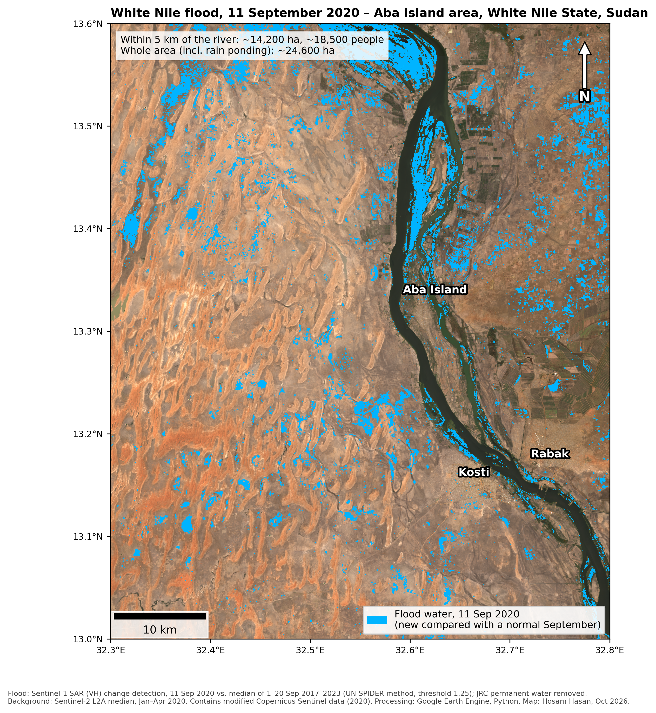
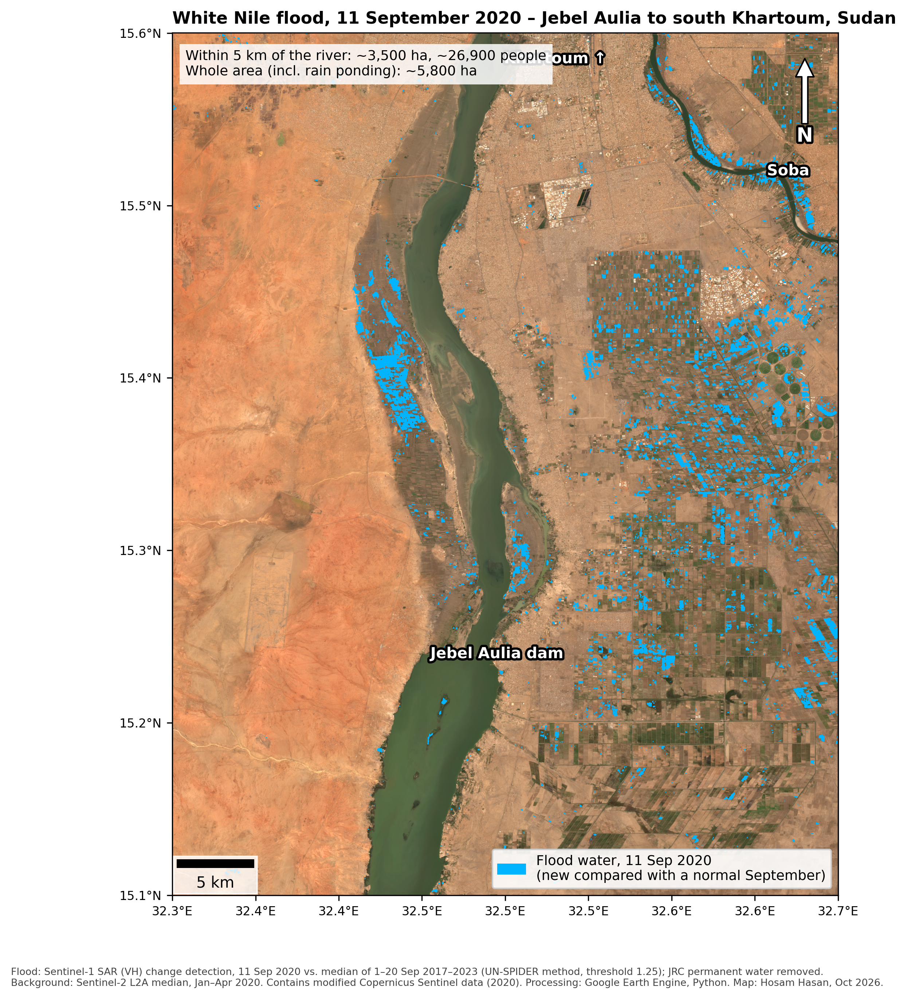

# Mapping the 2020 White Nile flood from space with Sentinel-1 radar

*Self-directed project · Google Earth Engine · Python · October 2026 · Hosam Hasan Abdalla*

In September 2020 the Nile at Khartoum reached its highest level since records began. I mapped the flooding at two White Nile sites: Aba Island in White Nile State, and the stretch from Jebel Aulia to south Khartoum.

Radar sees through rainy-season clouds, so I used Sentinel-1. I compared an image from 11 September 2020, four days after the record peak, with a normal September: the median of 1 to 20 September in 2017 to 2023, from the same satellite track. I followed the UN-SPIDER change-detection method, removed permanent water (JRC), noise and steep slopes, and estimated the people living in flooded cells with WorldPop 2020.

The choice of baseline changed the answer in both directions. A dry-season baseline under-counted flooding at Aba, where dry sand already looks dark on radar, and over-counted it at Jebel Aulia, where it picked up normal seasonal water. Height above drainage (HAND) could not separate the floodplain in such flat terrain, so I measured flooding within 2 and 5 km of the river instead.

At Aba Island, about 14,200 ha flooded within 5 km of the river, with about 18,500 people in flooded cells, half of them within 2 km. At Jebel Aulia only about 3,500 ha flooded, but about 26,900 people were exposed, because the narrow flood strips lie next to dense suburbs.

The analysis uses a single radar date, and the flooded area changes with the threshold. Radar alone cannot tell river flooding apart from rain ponds or changes in fields, and it misses water under vegetation and between buildings. The results have not been checked on the ground.

The next steps are to estimate the roads and buildings exposed and to automate the workflow in Python.

## Results

Normal-September baseline, threshold 1.25. Areas rounded to the nearest 100 ha; people are those living in WorldPop 2020 cells mapped as flooded, not people whose homes flooded.

| Site | Within 2 km of river | Within 5 km of river | Whole study area |
|---|---|---|---|
| Aba Island | 8,100 ha · ~13,000 people | 14,200 ha · ~18,500 people | 24,600 ha · ~25,700 people |
| Jebel Aulia | 1,600 ha · ~16,900 people | 3,500 ha · ~26,900 people | 5,800 ha · ~33,600 people |

The whole-area figures include rain ponds and field changes away from the river.

Threshold sensitivity, Aba Island (flooded ha, whole area): 52,400 at 1.15 · 35,700 at 1.20 · 24,500 at 1.25 · 16,900 at 1.30 · 11,700 at 1.35.

Baseline comparison (whole area, threshold 1.25):

| Site | Dry baseline (May to June 2020) | Normal-September baseline |
|---|---|---|
| Aba Island | 10,200 ha | 24,600 ha |
| Jebel Aulia | 6,600 ha | 5,800 ha |

## Repository contents

| Path | What it is |
|---|---|
| `gee/flood_mapping_sentinel1.js` | Earth Engine script: flood detection, statistics, river zones, exports |
| `colab/make_flood_maps.py` | Python code (Google Colab) that draws the two maps from the exported files |
| `maps/` | Final maps, 300 dpi |

## How to reproduce

1. Open the [Earth Engine Code Editor](https://code.earthengine.google.com), paste `gee/flood_mapping_sentinel1.js`, and set `AOI_NAME` to `'AbaIsland'` or `'JebelAulia'`.
2. Click Run. Results print in the Console.
3. In the Tasks tab, run the exports. Files go to the Google Drive folder `ProjectA_GEE`.
4. In Google Colab, install `rasterio` and `matplotlib-scalebar`, mount Google Drive, and run `colab/make_flood_maps.py`.

## Data

- Copernicus Sentinel-1 GRD (ESA), via Google Earth Engine
- Copernicus Sentinel-2 L2A, map background
- JRC Global Surface Water v1.4 (Pekel et al., 2016)
- WorldPop 2020, 100 m population
- HydroSHEDS DEM (slope mask); MERIT Hydro HAND (tested, not used)
- Method: UN-SPIDER Recommended Practice, flood mapping and damage assessment using Sentinel-1 SAR data in Google Earth Engine

Contains modified Copernicus Sentinel data (2020).
